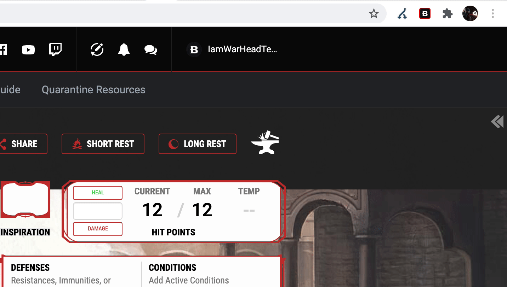
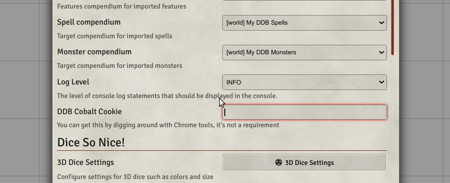
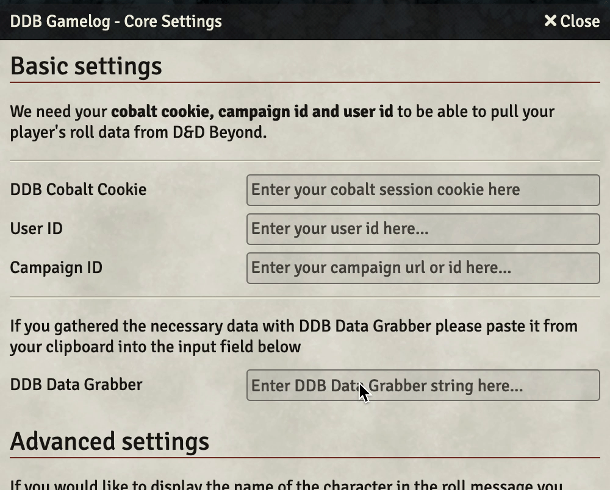

# DDB Data Grabber Chrome Extension

This is a helper extension for 
- [MrPrimate's DDB-Importer](https://github.com/mrprimate/ddb-importer)
- [IamWarHead's DDB-Gamelog](https://github.com/iamwarhead/ddb-game-log)

Right now it helps you extract the dndbeyond.com Cobalt Session token and Cobalt UserID to use for authentication against their api endpoints.

## Installation

Download the latest release zip from one of the following urls:
- [MrPrimate's release page](https://github.com/MrPrimate/ddb-data-grabber/releases)
- [IamWarhead's release page](https://github.com/IamWarHead/ddb-data-grabber/releases)

1. Unzip the release
2. Go to Chrome Extensions page (Menu->More Tools->Extensions)
3. Enable Developer Mode (Top-right corner)
4. Click on the 'Load Unpacked' button
5. Select the Directory where you extracted this extension

## Usage

### How to collect the necessary data

&nbsp;

## Importing the collected data into DDB Importer & DDB Gamelog
### Importing into DDB Importer
 <!-- You should change this image -->

&nbsp;

### Importing into DDB Gamelog
